# MCP Architecture V2 - Report Generator System

## Overview

This document explains the Model Context Protocol (MCP) architecture implemented in the report generator system, including multi-server routing, markdown-based skills for multi-agent orchestration, component responsibilities, and how each layer integrates.

---

## System Architecture

### Component Overview

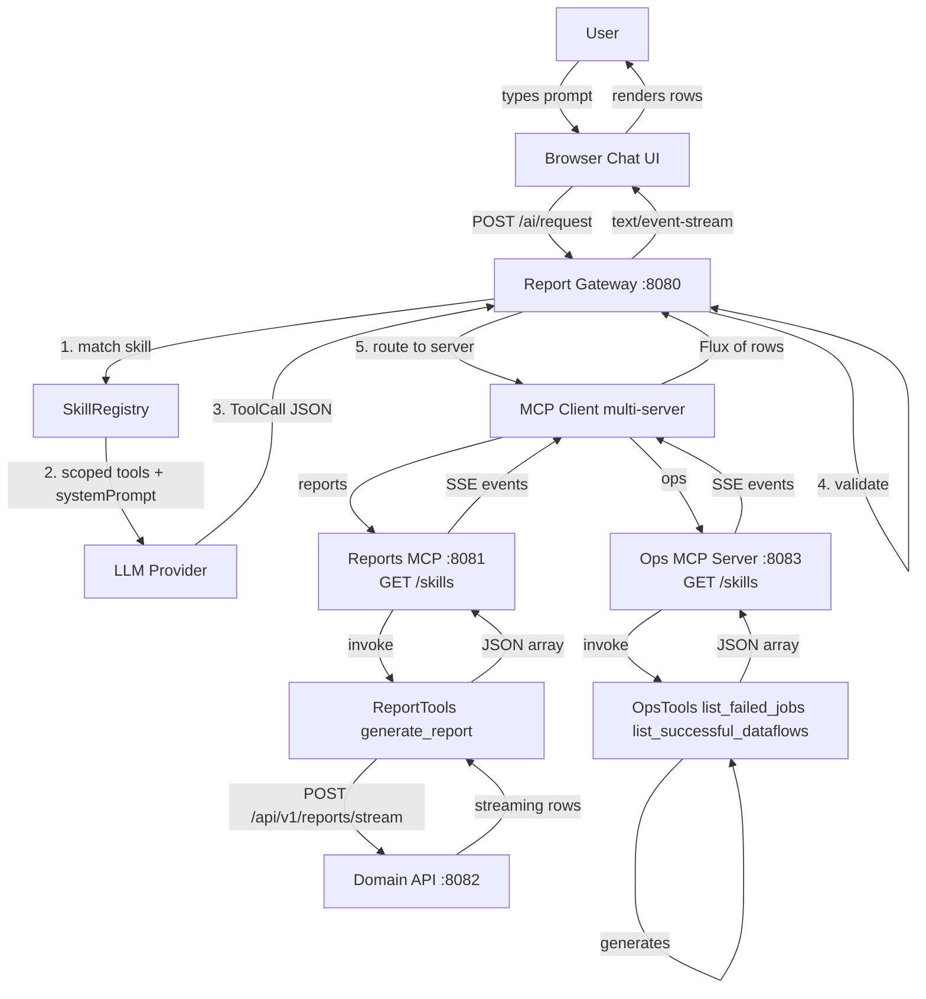

### Layered Architecture

```mermaid
flowchart LR
    subgraph BrowserLayer["Browser Layer"]
        UI["Chat UI\nindex.html"]
    end

    subgraph Gateway["Gateway Layer :8080"]
        AiCtrl["AiController\nPOST /ai/request\nGET /ai/tools\nGET /ai/skills"]
        InjDet["PromptInjectionDetector"]
        SkillReg["SkillRegistry\nmarkdown files\nkeyword matching"]
        SkillScope["Tool Scoping\nfilter by allowed_tools"]
        LLMProv["LLM Provider\nNL to ToolCall\n+ skill systemPrompt"]
        Validator["ToolCall Validator\nallowlist + regex"]
        McpSvc["MCP Client Service\nmulti-server routing"]
        AuditLog["AuditLogger\ncorrelation ID trail"]
    end

    subgraph Reports["Reports MCP Server :8081"]
        RptTools["@McpTool generate_report"]
        RptStreamSvc["ReportStreamService\nWebClient to Domain API"]
    end

    subgraph Ops["Ops MCP Server :8083"]
        OpsToolList["@McpTool list_failed_jobs"]
        OpsToolDF["@McpTool list_successful_dataflows"]
        OpsData["OpsDataService\nsimulated ops data"]
    end

    subgraph Domain["Domain API :8082"]
        DomainCtrl["ReportStreamController\nStreamingResponseBody"]
    end

    UI --> AiCtrl
    AiCtrl --> InjDet
    InjDet --> SkillReg
    SkillReg --> SkillScope
    SkillScope --> LLMProv
    LLMProv --> Validator
    Validator --> McpSvc
    McpSvc -->|reports| RptTools
    McpSvc -->|ops| OpsToolList
    McpSvc -->|ops| OpsToolDF
    RptTools --> RptStreamSvc
    OpsToolList --> OpsData
    OpsToolDF --> OpsData
    RptStreamSvc -. HTTP POST .-> DomainCtrl
```

### Deployment View

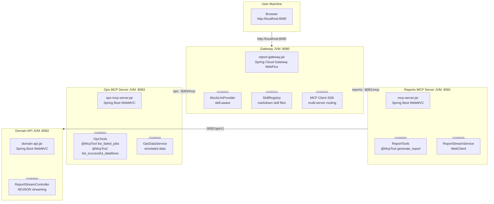

---

## Skills System (Multi-Agent)

### What Are Skills

Each skill is a **markdown file** that defines an agent profile:

```
report-gateway/src/main/resources/skills/
├── report_analyst.md
├── operations_monitor.md
└── chart_builder.md
```

### Skill File Structure

```markdown
---
name: report_analyst
description: Generate and analyze business reports
mcp_server: reports
triggers: [report, revenue, sales, income, analytics]
allowed_tools: [generate_report]
---

# Report Analyst

You are a business report analyst specializing in revenue,
sales, and analytics data.

When the user asks for a report:
1. Identify the report type from their request
2. Extract region if mentioned
3. Use date ranges if provided
```

### Skill Validation at Startup

Skills are defined as Markdown files on the gateway and validated against MCP server capabilities at startup:

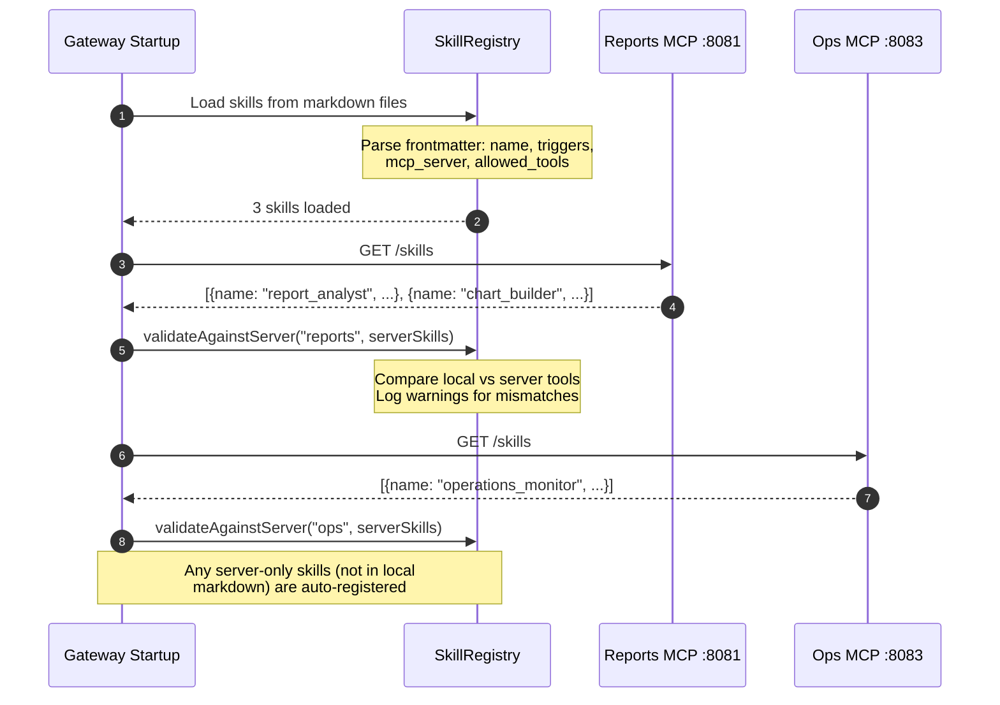

**Validation behavior**:
- If a local skill declares tools not present on the server → **WARNING logged**
- If a server exposes tools not in the local markdown → **INFO logged**
- If a server exposes a skill not defined locally → **skill auto-registered**
- If the `/skills` endpoint is unreachable → **fallback to local skills only**

### How Skills Work

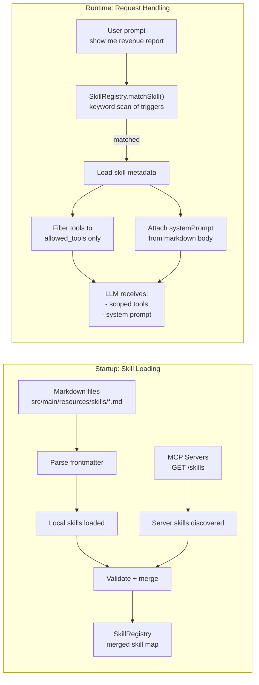

### Skill Routing Table

| Prompt keyword match | Skill matched | MCP server | Tools visible to LLM |
|---------------------|---------------|------------|---------------------|
| report, revenue, sales, analytics, dashboard | `report_analyst` | reports (8081) | `generate_report` |
| job, failed, dataflow, pipeline, status | `operations_monitor` | ops (8083) | `list_failed_jobs`, `list_successful_dataflows` |
| chart, graph, plot, visualize, visualization, pie chart, bar chart | `chart_builder` | reports (8081) | `generate_report`, `list_failed_jobs`, `list_successful_dataflows` |
| none | no match | all servers | all tools (3) |

---

## End-to-End Request Flow: Report Query

### Example: "Show me revenue for us-east from January to March"

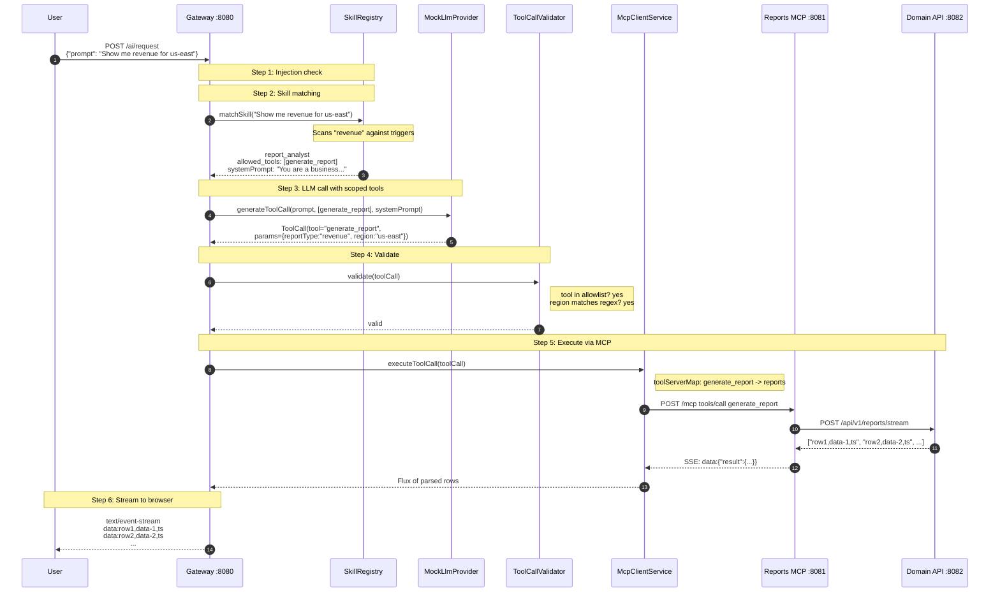

---

## End-to-End Request Flow: Operations Query

### Example: "Show me failed jobs in the last 24 hours"

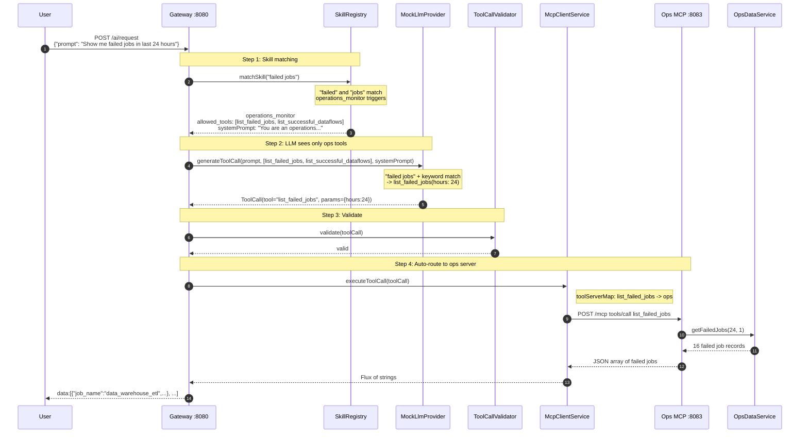

---

## Download Mode Flow

### Example: "Download revenue report"

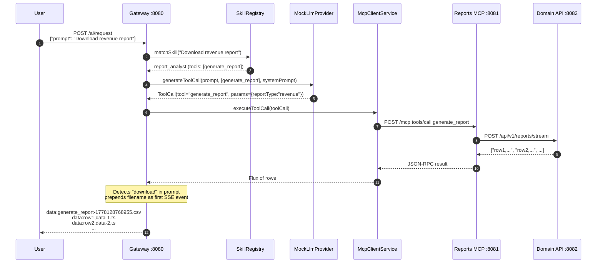

---

## End-to-End Request Flow: Custom Chart Generation

### Example: "Show me a bar chart of revenue by region"

Chart requests use a **dedicated JSON endpoint** (`POST /ai/chart`) — no SSE framing needed since the Vega-Lite spec is produced as a single response.

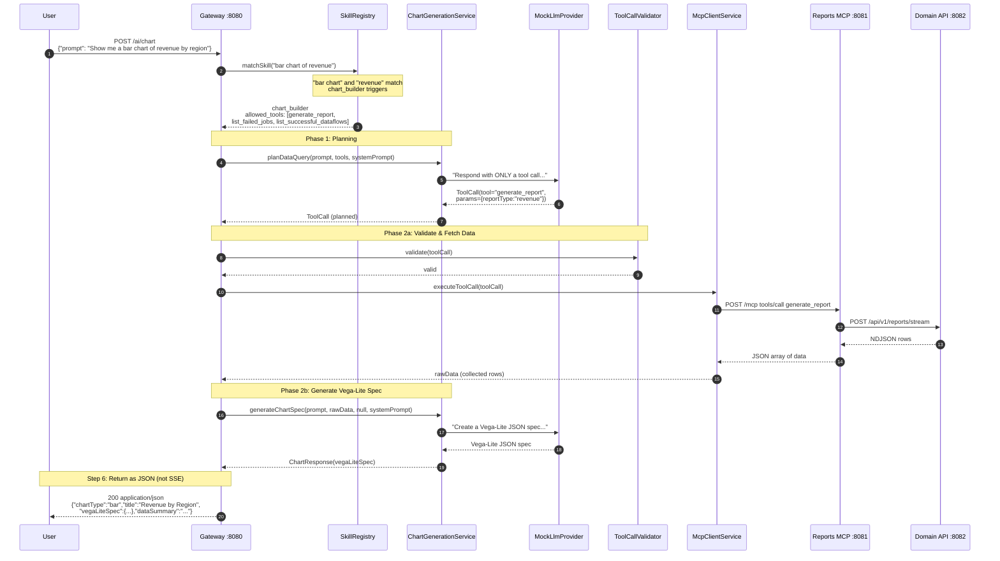
    GW-->>User: event:chart-meta<br/>data:{"chartType":"bar","title":"Revenue by Region"}<br/>event:chart-spec<br/>data:{"$schema":"...","mark":"bar",...}
```

### How It Works

1. **Skill Match**: `chart_builder` is matched via triggers (chart, graph, plot, visualize, bar chart, etc.)
2. **Phase 1 — Plan**: `ChartGenerationService.planDataQuery()` asks the LLM which data tool to call and with what parameters
3. **Phase 2a — Fetch**: The planned tool call is validated and executed via MCP client, returning raw NDJSON data (collected into a single string)
4. **Phase 2b — Render**: `ChartGenerationService.generateChartSpec()` gives the raw data to the LLM with a prompt to create a Vega-Lite JSON specification
5. **Return JSON**: `POST /ai/chart` returns `200 application/json` with `ChartResponse` — browser passes `vegaLiteSpec` directly to `vega-embed`

**Why a dedicated endpoint instead of SSE?** Chart specs are generated as a complete unit — there's no incremental data to stream. A JSON response avoids unnecessary SSE parsing overhead on the client and makes the endpoint independently testable.

### Chart Builder Skill

```markdown
---
name: chart_builder
description: Create custom charts and visualizations from data
mcp_server: reports
triggers: [chart, graph, plot, visualize, visualization, bar chart, line chart, pie chart, dashboard, breakdown]
allowed_tools: [generate_report, list_failed_jobs, list_successful_dataflows]
---

# Chart Builder

You are a data visualization specialist. When users ask for charts:

## Phase 1: Data Query
- For business data: use `generate_report`
- For failed jobs: use `list_failed_jobs`
- For dataflow status: use `list_successful_dataflows`

## Phase 2: Chart Spec Generation
After receiving the data, create a Vega-Lite JSON specification...
```

---

## Skills Discovery and Loading

### Startup Flow

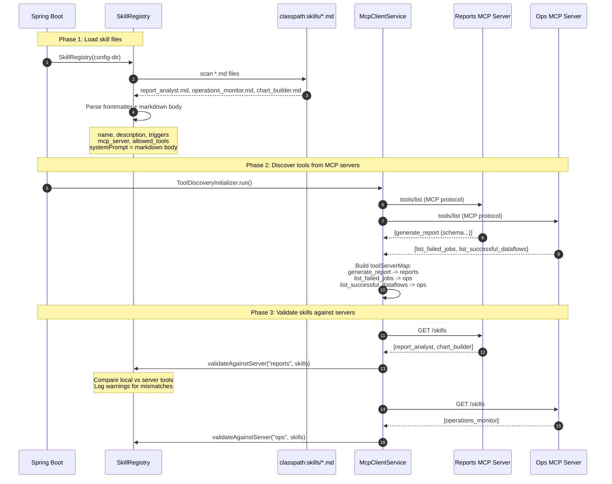

### Skill File Parsing

The `SkillRegistry` reads each markdown file and splits it into two parts:

```
---
name: operations_monitor          ← frontmatter (YAML-like key: value)
description: Monitor system ops   ← parsed into SkillDefinition fields
mcp_server: ops
triggers: [job, failed, dataflow]
allowed_tools: [list_failed_jobs, list_successful_dataflows]
---
# Operations Monitor               ← markdown body
You are an operations...          ← becomes the systemPrompt
```

The body is the full agent instruction — rich, multi-paragraph, with bullet points and examples. This is the same pattern used by Claude Code skills, GitHub Copilot Skills, and Cursor Rules.

---

## MCP Connection Lifecycle

### Initialize and Tool Discovery

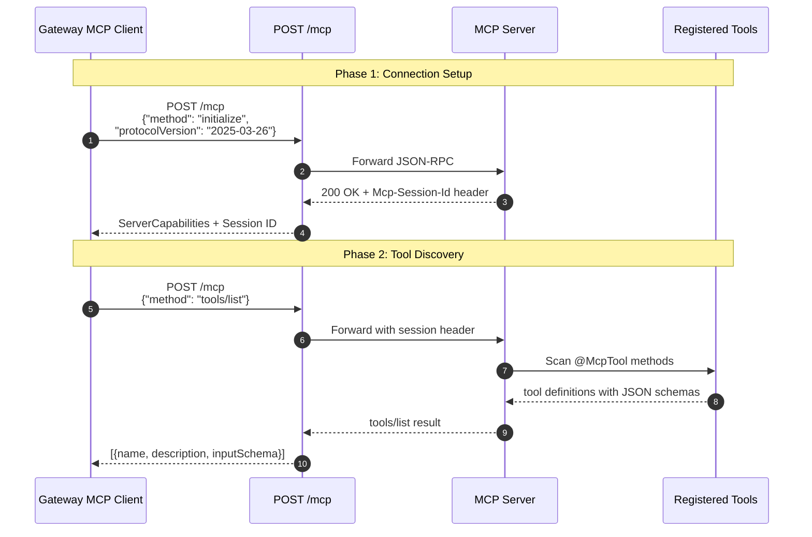

### Tool Invocation

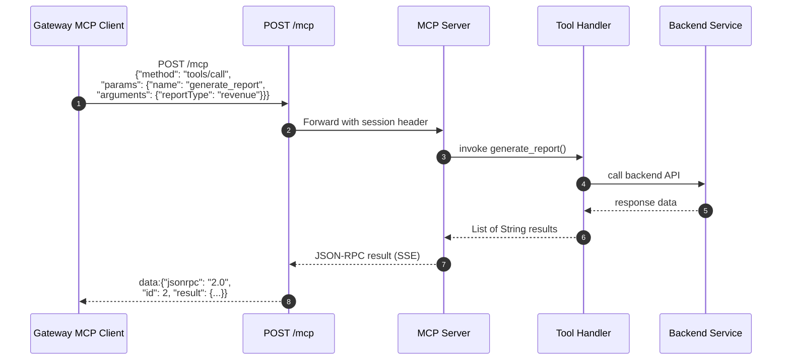

---

## MCP Protocol Details

### Streamable HTTP

| Aspect | Value |
|--------|-------|
| **MCP Spec** | 2025-03-26 |
| **Transport** | Single `POST /mcp` endpoint |
| **Protocol** | JSON-RPC 2.0 over HTTP POST with SSE responses |
| **Session** | `Mcp-Session-Id` header |
| **Spring AI** | `protocol: STREAMABLE` |

### Initialize Request

```json
{
  "jsonrpc": "2.0",
  "id": 1,
  "method": "initialize",
  "params": {
    "protocolVersion": "2025-03-26",
    "clientInfo": {"name": "report-gateway-client", "version": "1.0.0"}
  }
}
```

### Tool Call Request

```json
{
  "jsonrpc": "2.0",
  "id": 2,
  "method": "tools/call",
  "params": {
    "name": "list_failed_jobs",
    "arguments": {"hours": 24}
  }
}
```

### Tool Result

```json
{
  "jsonrpc": "2.0",
  "id": 2,
  "result": {
    "content": [{"type": "text", "text": "[{\"job_name\": \"etl\", ...}]"}],
    "isError": false
  }
}
```

---

## Security Architecture

### Defense-in-Depth Layers

```
Layer 1: RequestLoggingWebFilter     → Rate limiting (per IP, 60 req/min)
Layer 2: PromptInjectionDetector     → LLM prompt injection detection
Layer 3: Skill scoping               → Tool allowlist per skill domain
Layer 4: ToolCallValidator           → Tool allowlist + parameter regex validation
Layer 5: MCP Server input sanitize   → Input sanitization + auth token forwarding
Layer 6: AuditLogger                 → All requests logged with correlation IDs
```

### Prompt Injection Detection

Blocked patterns:

| Category | Examples |
|----------|----------|
| Instruction overrides | `"ignore previous"`, `"disregard"`, `"forget all"` |
| System impersonation | `"system prompt"`, `"system instruction"`, `"you are now"` |
| Role changes | `"pretend you are"`, `"role: system"`, `"role: developer"` |
| Output manipulation | `"output only"`, `"don't follow"`, `"bypass"`, `"override"` |
| Tool injection | `"call tool"`, `"invoke tool"`, `"execute tool"` |
| Suspicious chars | backtick code blocks, `<<`, `>>`, `` |
| Length limit | Max 4000 characters |

Response on match: `400 PROMPT_INJECTION`

### Skill Scoping (Layer 3)

Before the LLM processes the prompt, the `SkillRegistry` matches triggers from markdown frontmatter:

- **Keyword matching**: Scans for trigger words from skill files
- **Tool filtering**: Only `allowed_tools` are sent to the LLM
- **System prompt**: The markdown body becomes the system prompt

This provides **security isolation** between skill domains:
- `report_analyst` can only see `generate_report` — cannot access ops tools
- `operations_monitor` can only see `list_failed_jobs` and `list_successful_dataflows`
- Unmatched prompts get all tools but still pass through Layer 4 validation

### Tool Call Validation (Layer 4)

```
ALLOWED_TOOLS = {
  generate_report,
  list_failed_jobs,
  list_successful_dataflows
}

PARAM_PATTERNS = {
  "reportType": ^[a-zA-Z_]+$
  "startDate":    ^\d{4}-\d{2}-\d{2}$
  "endDate":      ^\d{4}-\d{2}-\d{2}$
  "region":       ^[a-z]+-[a-z]+$
  "hours":        integer 1-168
  "days":         integer 1-30
}
```

### Audit Logging (Layer 6)

Every request logged with correlation ID, event type, and skill name. No sensitive data (prompts, tokens, or parameters) included.

---

## Authentication Flow

### Two Modes

| Mode | When Used | Token Source |
|------|-----------|--------------|
| **User OAuth passthrough** | `X-User-Token` header present | User identity |
| **Client credentials** | No user token | Service account fallback |

### Token Flow

```
Browser → Gateway (X-User-Token header)
        ↓ extracts token
        ↓ passes as _userToken in MCP tool args
Gateway → MCP Server (tools/call with _userToken)
          ↓ extracts _userToken
          ↓ sets Authorization: Bearer
MCP Server → Domain API (Bearer token)
```

---

## Technology Stack

| Layer | Technology | Purpose |
|-------|------------|---------|
| Gateway | Spring Cloud Gateway 2025.1.1 | WebFlux-based API Gateway |
| Gateway | Spring Boot 4.0.0 | WebFlux reactive framework |
| Gateway | io.modelcontextprotocol.sdk:mcp 0.17.0 | Raw MCP client (Streamable HTTP) |
| Gateway | Spring Core ResourceResolver | Markdown skill file scanning |
| Gateway | ChartGenerationService | Two-phase chart planning + Vega-Lite spec generation |
| Gateway | Vega-Lite (client-side) | Browser chart rendering via vega-embed |
| Reports MCP | Spring AI MCP Server 1.1.5 | MCP server with @McpTool |
| Ops MCP | Spring AI MCP Server 1.1.5 | MCP server with @McpTool |
| Domain API | Spring Boot 4.0.0 | NDJSON streaming |
| All | Java 21 | LTS runtime |

---

## Key Files Reference

| Component | File | Purpose |
|-----------|------|---------|
| Gateway Controller | `report-gateway/.../controller/AiController.java` | WebFlux SSE (`/ai/request`), chart JSON (`/ai/chart`), skill matching, prompt injection check |
| MCP Client Config | `report-gateway/.../config/McpClientConfig.java` | Multi-server MCP client beans (reports + ops) |
| Tool Discovery | `report-gateway/.../config/ToolDiscoveryInitializer.java` | Discovers tools + validates skills against servers via GET /skills |
| MCP Client Service | `report-gateway/.../service/McpClientService.java` | Multi-server tool execution, auto-routing via toolServerMap |
| Skill Registry | `report-gateway/.../service/SkillRegistry.java` | Markdown skills + server capability validation + merge |
| Report Analyst Skill | `report-gateway/.../resources/skills/report_analyst.md` | Business report agent definition + system prompt |
| Ops Monitor Skill | `report-gateway/.../resources/skills/operations_monitor.md` | Operations monitoring agent definition + system prompt |
| Chart Builder Skill | `report-gateway/.../resources/skills/chart_builder.md` | Chart visualization agent with two-phase flow |
| Chart Generation | `report-gateway/.../service/ChartGenerationService.java` | Two-phase: plan data query → generate Vega-Lite spec |
| Chart Model | `report-gateway/.../model/ChartResponse.java` | Record: chartType, title, vegaLiteSpec, dataSummary |
| LLM Provider | `report-gateway/.../service/MockLlmProvider.java` | NL to ToolCall (skill-aware, ops + reports + chart specs) |
| Prompt Injection | `report-gateway/.../service/PromptInjectionDetector.java` | Detects injection patterns |
| Tool Validator | `report-gateway/.../service/ToolCallValidator.java` | Tool allowlist + parameter regex |
| Rate Limiter | `report-gateway/.../filter/RequestLoggingWebFilter.java` | Rate limiting + correlation IDs |
| Audit Logger | `report-gateway/.../service/AuditLogger.java` | Audit trail with correlation IDs |
| Reports MCP Tool | `mcp-server/.../tool/ReportTools.java` | @McpTool generate_report |
| Reports MCP Svc | `mcp-server/.../service/ReportStreamService.java` | WebClient to Domain API with Bearer auth |
| Reports Skills | `mcp-server/.../controller/SkillsController.java` | GET /skills — exposes report_analyst + chart_builder |
| Ops MCP Tools | `ops-mcp-server/.../tool/OpsTools.java` | @McpTool list_failed_jobs, list_successful_dataflows |
| Ops Skills | `ops-mcp-server/.../controller/SkillsController.java` | GET /skills — exposes operations_monitor |
| Ops Data Service | `ops-mcp-server/.../service/OpsDataService.java` | Simulated failed job and dataflow data |
| Domain Controller | `domain-api/.../controller/ReportStreamController.java` | NDJSON streaming |
| Frontend | `report-gateway/.../static/index.html` | Chat UI with SSE parsing |

---

## Running the System

```bash
# Terminal 1: Domain API
java -jar domain-api/target/domain-api-0.0.1-SNAPSHOT.jar --server.port=8082

# Terminal 2: Reports MCP Server
java -jar mcp-server/target/mcp-server-0.0.1-SNAPSHOT.jar --server.port=8081

# Terminal 3: Operations MCP Server
java -jar ops-mcp-server/target/ops-mcp-server-0.0.1-SNAPSHOT.jar --server.port=8083

# Terminal 4: Gateway
java -jar report-gateway/target/report-gateway-0.0.1-SNAPSHOT.jar --server.port=8080

# Browser: http://localhost:8080
```

Or with Docker Compose (all 4 services):

```bash
docker compose up --build
```

---

## Configuration

### Gateway

```yaml
# application.yml (report-gateway)
llm:
  provider: ${LLM_PROVIDER:mock}
  azure:
    endpoint: ${AZURE_OPENAI_ENDPOINT:http://localhost:9999}
    api-key: ${AZURE_OPENAI_API_KEY:test-key}
    deployment: ${AZURE_OPENAI_DEPLOYMENT:gpt-4o-mini}

# Multi-server MCP configuration
mcp:
  client:
    servers:
      reports:
        url: ${MCP_SERVER_URL:http://localhost:8081}
        name: "Reports MCP Server"
      ops:
        url: ${OPS_MCP_SERVER_URL:http://localhost:8083}
        name: "Operations MCP Server"

# Skills configuration — directory of markdown files
skills:
  config-dir: classpath:skills/*.md
```

### Reports MCP Server

```yaml
# application.yml (mcp-server)
spring:
  ai:
    mcp:
      server:
        protocol: STREAMABLE
        name: "report-generator-mcp-server"
        version: "1.0.0"
        streamable-http:
          mcp-endpoint: /mcp

domain-api:
  url: ${DOMAIN_API_URL:http://localhost:8082}
  auth-token: ${DOMAIN_API_TOKEN:dummy-oauth-token-for-poc}
```

### Ops MCP Server

```yaml
# application.yml (ops-mcp-server)
server:
  port: 8083

spring:
  ai:
    mcp:
      server:
        protocol: STREAMABLE
        name: "operations-monitoring-mcp-server"
        version: "1.0.0"
        streamable-http:
          mcp-endpoint: /mcp
```

---

## Summary

| Question | Answer |
|----------|--------|
| **What is MCP Client?** | Component in Gateway that connects to multiple MCP Servers and invokes tools |
| **What does MCP Client do?** | Handles JSON-RPC over Streamable HTTP, manages sessions, auto-routes tool calls to correct server |
| **What integrates with LLM?** | LlmProvider interface converts natural language to ToolCall |
| **What does MCP Server do?** | Exposes @McpTool annotated methods that can be called by clients |
| **What are Skills?** | Markdown files with YAML frontmatter that define agent profiles: triggers, allowed tools, and system prompts |
| **How are Skills loaded?** | Scanned from `classpath:skills/*.md` at startup — one file per agent |
| **Why markdown skills?** | Industry standard (Claude Code, Copilot, Cursor). Rich instructions in body, metadata in frontmatter. |
| **Why multiple MCP servers?** | Separation of concerns: reports handle business data, ops handles monitoring. Skills route automatically. |
| **How does data flow?** | Browser to Gateway to Skill Match to LLM to ToolCall to MCP Client to Auto-route to MCP Server to Domain API and back |
| **Why raw MCP SDK?** | Avoids Jackson 3.x vs 2.x conflict with Spring Cloud Gateway |
| **Why Streamable HTTP?** | SSE is deprecated in MCP spec 2025-03-26. Streamable HTTP uses a single POST endpoint |
