# MCP Architecture V2 - Report Generator System

## Overview

This document explains the Model Context Protocol (MCP) architecture implemented in the report generator system, including the flow of data, component responsibilities, and how each layer integrates.

---

## System Architecture

### Component Overview

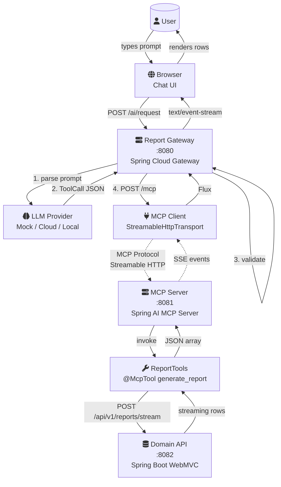

### Layered Architecture

```mermaid
flowchart LR
    subgraph Browser["Browser Layer"]
        UI["Chat UI\nindex.html"]
    end

    subgraph Gateway["Gateway Layer (:8080)"]
        subgraph WebFlux["WebFlux Layer"]
            AiCtrl["AiController\nPOST /ai/request\nGET /ai/status"]
            Static["Static Resources\n/"]
        end
        subgraph Orchestrator["Orchestration Layer"]
            LLMProv["LLM Provider\nNatural Language → ToolCall"]
            Validator["ToolCall Validator\nSchema + Regex"]
            McpSvc["MCP Client Service\nexecuteToolCall()"]
        end
        subgraph Transport["Transport Layer"]
            McpTrans["HttpClientStreamableHttpTransport\nPOST /mcp\nSession: Mcp-Session-Id header"]
        end
    end

    subgraph MCPServerLayer["MCP Server Layer (:8081)"]
        subgraph MCPEndpoint["Streamable HTTP Endpoint"]
            SseTransport["POST /mcp\nContent-Type: application/json\nAccept: text/event-stream"]
        end
        subgraph ToolLayer["Tool Layer"]
            RptTools["ReportTools\n@McpTool generate_report\n@McpToolParam annotations"]
        end
        subgraph ServiceLayer["Service Layer"]
            RptStreamSvc["ReportStreamService\nWebClient → Domain API"]
        end
    end

    subgraph DomainLayer["Domain API Layer (:8082)"]
        subgraph DomainCtrl["Controller"]
            ReportStreamCtrl["ReportStreamController\nPOST /api/v1/reports/stream\nStreamingResponseBody"]
        end
    end

    UI --> AiCtrl
    AiCtrl --> LLMProv
    LLMProv --> Validator
    Validator --> McpSvc
    McpSvc --> McpTrans
    McpTrans -. "MCP Protocol\nStreamable HTTP" .-> SseTransport
    SseTransport --> RptTools
    RptTools --> RptStreamSvc
    RptStreamSvc -. "HTTP POST" .-> ReportStreamCtrl
```

### Deployment View

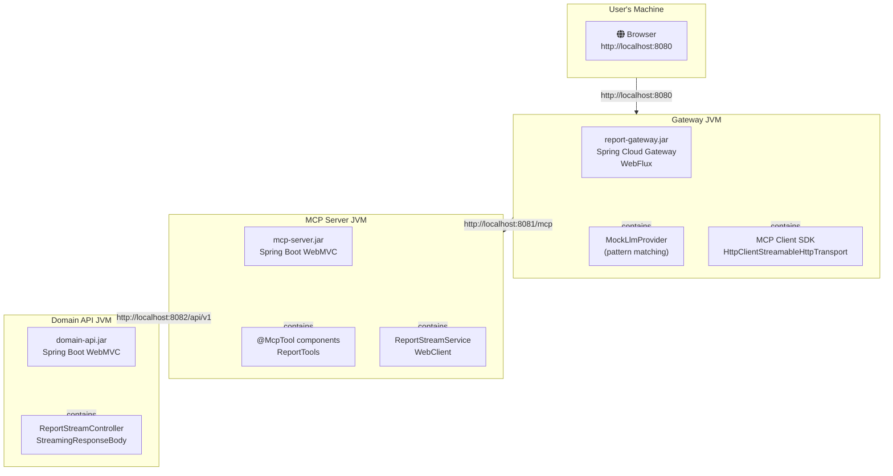

---

## What is MCP (Model Context Protocol)?

### Definition
MCP is a protocol standardized by Anthropic that defines how **AI clients** (like Claude, LLM gateways) communicate with **tool servers** that expose capabilities to the AI.

### Key Concepts

#### MCP Server
- **Purpose**: Exposes tools (functions) that an LLM can call
- **Transport**: Streamable HTTP (spec version 2025-03-26)
- **Protocol**: JSON-RPC 2.0 over HTTP POST with SSE responses
- **Endpoint**: Single `POST /mcp` endpoint (no separate SSE connection needed)
- **Session**: Managed via `Mcp-Session-Id` header
- **Registration**: Tools are registered with names, descriptions, and JSON schemas for parameters

#### MCP Client
- **Purpose**: Connects to an MCP Server and invokes tools
- **Transport**: `HttpClientStreamableHttpTransport` (raw MCP SDK)
- **Lifecycle**:
  1. **Initialize**: Client POSTs to `/mcp` with `initialize` request, server responds with capabilities + `Mcp-Session-Id`
  2. **tools/list**: Client discovers available tools (includes session header)
  3. **tools/call**: Client invokes a tool with parameters (single POST, SSE response stream)
- **Response**: Tool returns content blocks (text, images, etc.)

---

## MCP Connection Lifecycle

```mermaid
sequenceDiagram
    autonumber
    participant Client as MCP Client<br/>(Gateway)
    participant Transport as Streamable HTTP<br/>(POST /mcp)
    participant Server as MCP Server<br/>(Spring AI)
    participant Scanner as @McpTool<br/>Scanner
    participant Tools as ReportTools

    Note over Client,Server: Phase 1: Connection Setup
    Client->>Transport: POST /mcp<br/>initialize request
    Note right of Client: protocolVersion: 2025-03-26<br/>clientInfo: report-gateway-client
    Transport->>Server: Forward JSON-RPC
    Server->>Scanner: Lookup registered tools
    Scanner-->>Server: tools/list: generate_report
    Server-->>Transport: Response + Mcp-Session-Id header
    Transport-->>Client: 200 OK<br/>ServerCapabilities + Session ID

    Note over Client,Server: Phase 2: Tool Discovery
    Client->>Transport: POST /mcp<br/>tools/list request
    Note right of Client: Mcp-Session-Id: <uuid>
    Transport->>Server: Forward with session header
    Server->>Scanner: Get all @McpTool definitions
    Scanner-->>Server: [{name: generate_report,<br/>description: "...",<br/>inputSchema: {...}}]
    Server-->>Transport: tools/list result
    Transport-->>Client: List of available tools

    Note over Client,Server: Phase 3: Tool Invocation
    Client->>Transport: POST /mcp<br/>tools/call request
    Note right of Client: name: generate_report<br/>arguments: {reportType: "revenue"}<br/>Mcp-Session-Id: <uuid>
    Transport->>Server: Forward with session header
    Server->>Scanner: Find generate_report method
    Scanner->>Tools: invoke generate_report()
    Note right of Tools: Calls Domain API<br/>Returns List&lt;String&gt;
    Tools-->>Scanner: ["row1,data...", "row2,data..."]
    Scanner-->>Server: Tool result content blocks
    Server-->>Transport: JSON-RPC result (SSE events)
    Transport-->>Client: data:{"jsonrpc":"2.0",<br/>"id":2,"result":{...}}
```

---

## End-to-End Request Flow

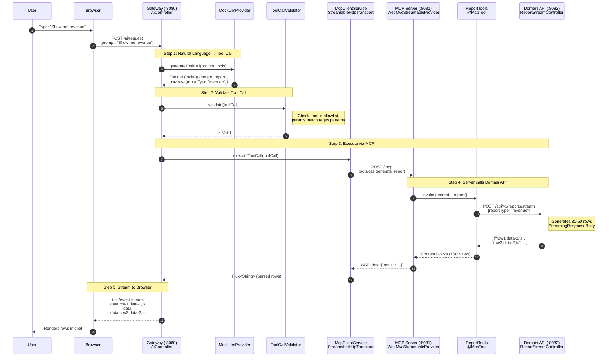

---

## Download Mode Flow

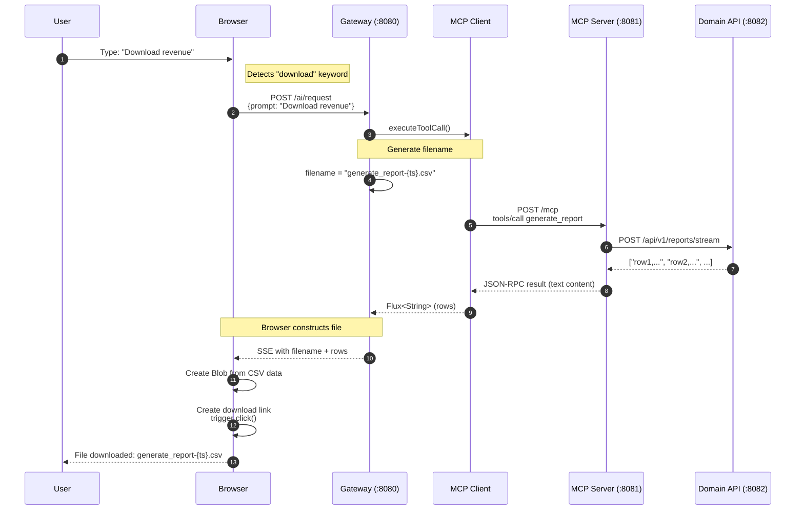

---

## Error Handling Flow

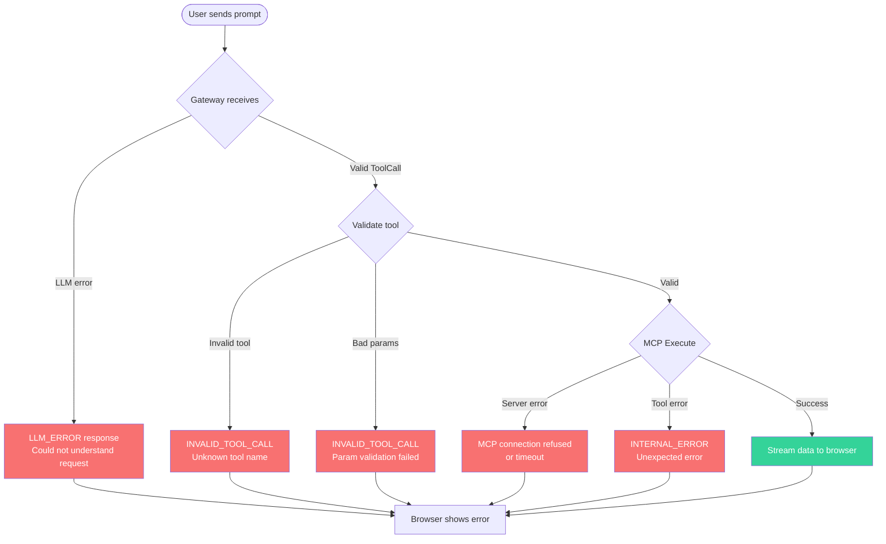

---

## SSE Protocol Comparison

| Aspect | SSE (Deprecated) | Streamable HTTP (Current) |
|--------|------------------|---------------------------|
| **MCP Spec** | 2024-11-05 | 2025-03-26 |
| **Connection** | Persistent SSE (`GET /sse`) | Stateless POST (`POST /mcp`) |
| **Endpoints** | Two: `/sse` + `/mcp/message` | One: `/mcp` |
| **Session** | URL-based (`sessionId` param) | Header-based (`Mcp-Session-Id`) |
| **Load Balancing** | Hard (sticky sessions needed) | Easy (standard HTTP) |
| **Reconnect** | Re-establish SSE connection | Retry POST with session header |
| **Server Push** | Yes (unsolicited via SSE) | No (response to request only) |
| **Spring AI Support** | `protocol: SSE` | `protocol: STREAMABLE` |

---

## Data Flow Walkthrough

### Step 1: User Sends Prompt
```
User: "Show me revenue for us-east"
```

### Step 2: Gateway Processes Request (AiController)
```java
// AiController.handleAiRequest()
1. LLMProvider.generateToolCall("Show me revenue for us-east", tools)
   → Returns: ToolCall(tool="generate_report", params={reportType="revenue", region="us-east"})

2. ToolCallValidator.validate(toolCall)
   → Validates: tool name is in allowlist, params match regex patterns

3. McpClientService.executeToolCall(toolCall, correlationId)
   → Calls MCP Server via Streamable HTTP (POST /mcp)
```

## Streamable HTTP Protocol Details

### Initialize → Session Creation

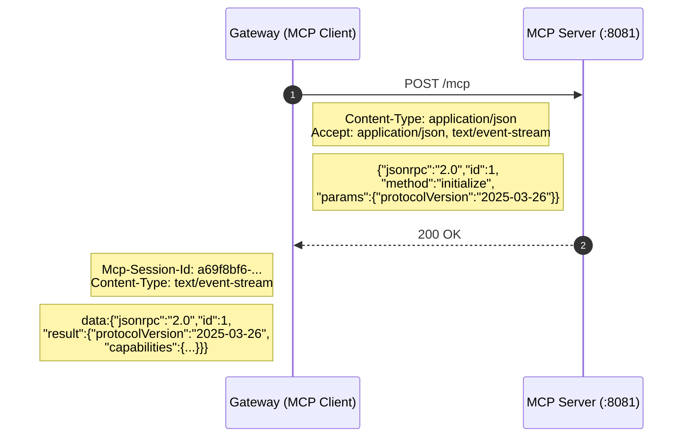

### Tool Call → Session Reuse

```mermaid
sequenceDiagram
    autonumber
    participant Client as Gateway (MCP Client)
    participant Server as MCP Server (:8081)
    participant Tool as ReportTools
    participant Domain as Domain API (:8082)

    Client->>Server: POST /mcp
    Note right of Client: Mcp-Session-Id: a69f8bf6-...<br/>Content-Type: application/json<br/>Accept: application/json, text/event-stream
    Note right of Client: {"method":"tools/call",<br/>"params":{"name":"generate_report",<br/>"arguments":{"reportType":"revenue"}}}

    Server->>Tool: invoke generate_report()
    Tool->>Domain: POST /api/v1/reports/stream
    Domain-->>Tool: ["row1,data-1,ts", "row2,...", ...]
    Tool-->>Server: List&lt;String&gt; result
    Server-->>Client: 200 OK (Content-Type: text/event-stream)
    Note left of Client: data:{"jsonrpc":"2.0","id":2,<br/>"result":{"content":[{"type":"text",<br/>"text":"[\"row1,...\",\"row2,...\"]"}]}}
```

---

## Step-by-Step Breakdown

### Step 1-2: User Sends Prompt → Gateway Processes

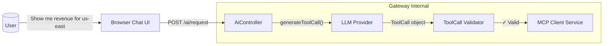

### Step 4: MCP Server Executes Tool

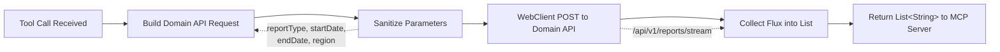

### Step 5: Domain API Streams Data

```
Domain API receives POST /api/v1/reports/stream
→ Generates rows as NDJSON (Newline-Delimited JSON)
→ Returns Flux<String> with one row per emission

Example output:
{"type":"header","data":{"reportType":"revenue","generatedAt":"2026-01-15"}}
{"type":"data","data":{"row":1,"product":"Widget A","revenue":15000}}
{"type":"data","data":{"row":2,"product":"Widget B","revenue":23000}}
...
{"type":"footer","data":{"totalRows":50,"totalRevenue":1250000}}
```

### Step 6: Response Flows Back

```
Domain API → MCP Server → MCP Client (Gateway) → Browser

Gateway transforms:
1. Receives JSON array from MCP: ["row1,data...", "row2,data..."]
2. Parses with Jackson: mapper.readValue(jsonArray, List.class)
3. Emits each row as Flux<String> → SSE events → Browser

Browser receives:
data:row1,data-1,1778036884627
data:

data:row2,data-2,1778036884627
data:
...
```

---

---

## Component Code Details

### MCP Client (report-gateway)

**File**: `report-gateway/src/main/java/com/example/gateway/service/McpClientService.java`

```java
@Service
public class McpClientService {
    private final McpAsyncClient mcpClient;  // From raw MCP SDK

    public Flux<String> executeToolCall(ToolCall toolCall, String correlationId) {
        // Convert ToolCall to MCP CallToolRequest
        Map<String, Object> args = mapper.convertValue(toolCall.parameters(), Map.class);

        return mcpClient.callTool(new McpSchema.CallToolRequest(toolCall.tool(), args))
            .flatMapMany(result -> {
                // Extract text content from MCP result
                return Flux.fromIterable(result.content())
                    .filter(content -> content instanceof McpSchema.TextContent)
                    .map(content -> ((McpSchema.TextContent) content).text());
            });
    }
}
```

**Configuration**: `McpClientConfig.java`
```java
@Bean
public McpAsyncClient mcpAsyncClient() {
    // Streamable HTTP transport — single POST endpoint, simpler than SSE
    var transport = HttpClientStreamableHttpTransport.builder("http://localhost:8081").build();

    // Build async client with implementation info
    return McpClient.async(transport)
        .clientInfo(new McpSchema.Implementation("report-gateway-client", "1.0.0"))
        .requestTimeout(Duration.ofSeconds(60))
        .build();
}
```

---

### MCP Server (mcp-server)

**File**: `mcp-server/src/main/java/com/example/mcp/tool/ReportTools.java`

```java
@Component
public class ReportTools {
    private final ReportStreamService reportStreamService;

    @McpTool(description = "Generate a structured report from domain data")
    public List<String> generate_report(
            @McpToolParam(description = "Type of report", required = true) String reportType,
            @McpToolParam(description = "Start date YYYY-MM-DD") String startDate,
            @McpToolParam(description = "End date YYYY-MM-DD") String endDate,
            @McpToolParam(description = "Region filter") String region
    ) {
        // Build request and call Domain API
        Map<String, Object> request = buildRequest(reportType, startDate, endDate, region);
        return reportStreamService.streamReport(request, UUID.randomUUID().toString())
            .collectList()
            .block();
    }
}
```

**Auto-Configuration**: Spring AI MCP Server starter scans for `@McpTool` methods and automatically registers them.

---

### LLM Provider Integration

**File**: `report-gateway/src/main/java/com/example/gateway/service/MockLlmProvider.java`

The LLM Provider is the bridge between natural language and structured tool calls:

```java
public interface LlmProvider {
    // Converts: "Show me revenue for us-east"
    // Into: ToolCall(tool="generate_report", params={reportType="revenue", region="us-east"})
    ToolCall generateToolCall(String userMessage, List<ToolDefinition> tools);
}
```

**Current Implementation**: Mock provider with simple pattern matching.

**Future**: Replace with real LLM (OpenAI, Claude, etc.) that uses the tool definitions to generate proper JSON tool calls.

---

## Technology Stack

| Layer | Technology | Purpose |
|-------|------------|---------|
| Gateway | Spring Cloud Gateway 2025.1.1 | WebFlux-based API Gateway |
| Gateway | Spring Boot 4.0.0 | WebFlux reactive framework |
| Gateway | MCP SDK 0.17.0 | Raw MCP client (Streamable HTTP) |
| MCP Server | Spring AI MCP Server 1.1.5 | MCP server with @McpTool |
| MCP Server | Spring Boot 4.0.0 | WebMVC for Streamable HTTP transport |
| Domain API | Spring Boot 4.0.0 | Report generation service |
| All | Java 21 | LTS runtime |

---

## Why Raw MCP SDK in Gateway?

Spring AI MCP Client starter (`spring-ai-starter-mcp-client-webflux`) was attempted but caused conflicts:

```
Error: NoClassDefFoundError: tools/jackson/core/JacksonException
```

**Root Cause**: Spring AI MCP annotations (v1.1.5) use Jackson 3.x classes, while Spring Cloud Gateway uses Jackson 2.x. The annotation scanner triggers during bean post-processing and fails.

**Solution**: Use raw `io.modelcontextprotocol.sdk:mcp:0.17.0` which:
- Has no Spring dependencies
- Works with standard Jackson 2.x
- Manual configuration in `McpClientConfig.java`

---

## Why Spring AI MCP Server in mcp-server?

Spring AI MCP Server starter works perfectly because:
- It runs in its own JVM (port 8081)
- No conflict with Spring Cloud Gateway
- `@McpTool` annotation scanning works correctly
- Auto-configures Streamable HTTP transport (since v1.1.5 via `protocol: STREAMABLE`)
- Single `/mcp` endpoint handles both initialization and tool calls

---

## Key Files Reference

| Component | File | Purpose |
|-----------|------|---------|
| Gateway Controller | `report-gateway/.../controller/AiController.java` | WebFlux REST API + SSE streaming, prompt injection check |
| MCP Client Config | `report-gateway/.../config/McpClientConfig.java` | Streamable HTTP transport setup |
| MCP Client Service | `report-gateway/.../service/McpClientService.java` | Tool execution via MCP SDK, user token forwarding |
| LLM Provider | `report-gateway/.../service/MockLlmProvider.java` | Natural language → ToolCall |
| Prompt Injection | `report-gateway/.../service/PromptInjectionDetector.java` | Detects injection patterns before LLM |
| Tool Validator | `report-gateway/.../service/ToolCallValidator.java` | Tool allowlist + parameter regex |
| Rate Limiter | `report-gateway/.../filter/RequestLoggingWebFilter.java` | Rate limiting + correlation IDs |
| MCP Tool | `mcp-server/.../tool/ReportTools.java` | @McpTool annotated methods + input sanitization |
| MCP Server Config | `mcp-server/.../application.yml` | `protocol: STREAMABLE`, `domain-api.auth-token` |
| Report Stream Svc | `mcp-server/.../service/ReportStreamService.java` | WebClient → Domain API with Bearer auth |
| Domain Controller | `domain-api/.../controller/ReportStreamController.java` | NDJSON streaming |
| Frontend | `report-gateway/.../static/index.html` | Chat UI with SSE parsing |

---

## Running the System

```bash
# Terminal 1: Domain API
java -jar domain-api/target/domain-api-0.0.1-SNAPSHOT.jar --server.port=8082

# Terminal 2: MCP Server
java -jar mcp-server/target/mcp-server-0.0.1-SNAPSHOT.jar --server.port=8081

# Terminal 3: Gateway
java -jar report-gateway/target/report-gateway-0.0.1-SNAPSHOT.jar --server.port=8080

# Browser: http://localhost:8080
```

---

## Configuration

### Configuration

#### Gateway
```yaml
# application.yml (report-gateway)
llm:
  provider: ${LLM_PROVIDER:mock}
  azure:
    endpoint: ${AZURE_OPENAI_ENDPOINT:http://localhost:9999}
    api-key: ${AZURE_OPENAI_API_KEY:test-key}
    deployment: ${AZURE_OPENAI_DEPLOYMENT:gpt-4o-mini}
```

The Gateway extracts the user's OAuth token from the `X-User-Token` request header and forwards it through the MCP tool call chain.

```yaml
# application.yml (report-gateway)
mcp:
  client:
    server-url: ${MCP_SERVER_URL:http://localhost:8081}
```

**Streamable HTTP**: The URL points to the base server address. The MCP SDK appends `/mcp` automatically for the Streamable HTTP transport endpoint.

```bash
# Correct — base URL, transport adds /mcp
export MCP_SERVER_URL=http://localhost:8081
```

#### MCP Server
```yaml
# application.yml (mcp-server)
spring:
  ai:
    mcp:
      server:
        protocol: STREAMABLE
        name: "report-generator-mcp-server"
        version: "1.0.0"
        streamable-http:
          mcp-endpoint: /mcp

domain-api:
  url: ${DOMAIN_API_URL:http://localhost:8082}
  auth-token: ${DOMAIN_API_TOKEN:dummy-oauth-token-for-poc}
```

The MCP Server forwards the user's OAuth token (from `X-User-Token` header) as a Bearer token to the Domain API. If no user token is present, it falls back to the configured `domain-api.auth-token` (client credentials mode).

```yaml
# application.yml (mcp-server)
spring:
  ai:
    mcp:
      server:
        protocol: STREAMABLE          # Use Streamable HTTP (not SSE)
        name: "report-generator-mcp-server"
        version: "1.0.0"
        streamable-http:
          mcp-endpoint: /mcp          # Single endpoint for all operations
```

---

## MCP Protocol Specification

### Initialize Request
```json
{
  "jsonrpc": "2.0",
  "id": 1,
  "method": "initialize",
  "params": {
    "protocolVersion": "2025-03-26",
    "capabilities": {},
    "clientInfo": {
      "name": "report-gateway-client",
      "version": "1.0.0"
    }
  }
}
```

### Initialize Response
```json
{
  "jsonrpc": "2.0",
  "id": 1,
  "result": {
    "protocolVersion": "2025-03-26",
    "capabilities": {
      "tools": { "listChanged": true },
      "prompts": { "listChanged": true },
      "resources": { "subscribe": false, "listChanged": true }
    },
    "serverInfo": {
      "name": "report-generator-mcp-server",
      "version": "1.0.0"
    }
  }
}
```
Response header: `Mcp-Session-Id: <uuid>`

### Tools/Call Request
```json
{
  "jsonrpc": "2.0",
  "id": 2,
  "method": "tools/call",
  "params": {
    "name": "generate_report",
    "arguments": {
      "reportType": "revenue",
      "region": "us-east"
    }
  }
}
```

### Tool Result Response
```json
{
  "jsonrpc": "2.0",
  "id": 2,
  "result": {
    "content": [
      {
        "type": "text",
        "text": "[\"row1,data...\", \"row2,data...\", ...]"
      }
    ],
    "isError": false
  }
}
```

---

## Security Architecture

### Defense-in-Depth Layers

The system implements **four security layers** between untrusted user input and the Domain API:

```
Layer 1: RequestLoggingWebFilter     → Rate limiting (per IP, 60 req/min)
Layer 2: AiController                → Prompt injection detection
Layer 3: ToolCallValidator           → Tool allowlist + parameter regex validation
Layer 4: ReportStreamService (MCP)   → Input sanitization + auth token forwarding
```

### Layer 1: Rate Limiting (RequestLoggingWebFilter)

Every request is rate-limited by client IP (60 requests/minute window). Excess requests get `429 Too Many Requests`.

### Layer 2: Prompt Injection Detection (AiController + PromptInjectionDetector)

Before the LLM sees the prompt, it's scanned for injection patterns:

```java
// In AiController.handleAiRequest():
injectionDetector.check(request.prompt());  // throws PromptInjectionException → 400 Bad Request
```

Blocked patterns include:

| Category | Examples |
|----------|----------|
| Instruction overrides | `"ignore previous"`, `"disregard previous"`, `"forget all"` |
| System impersonation | `"system prompt"`, `"system instruction"`, `"you are now"` |
| Role changes | `"pretend you are"`, `"role: system"`, `"role: developer"` |
| Output manipulation | `"output only"`, `"don't follow"`, `"bypass"`, `"override"` |
| Tool injection | `"call tool"`, `"invoke tool"`, `"execute tool"` |
| Suspicious chars | ` ``` `, `<<`, `>>`, `` |
| Length limit | Max 4000 characters |

If a pattern matches, the request returns immediately with:
```json
{"error": "PROMPT_INJECTION", "message": "Prompt contains blocked pattern: 'ignore previous'"}
```

### Layer 3: Tool Call Validation (ToolCallValidator)

After the LLM produces a `ToolCall`, it passes through strict validation:

```java
// Tool allowlist
ALLOWED_TOOLS = Set.of("generate_report")

// Parameter regex patterns
PARAM_PATTERNS = Map.of(
    "reportType", Pattern.compile("^[a-zA-Z_]+$"),          // No numbers, no special chars
    "startDate",    Pattern.compile("^\\d{4}-\\d{2}-\\d{2}$"), // YYYY-MM-DD only
    "endDate",      Pattern.compile("^\\d{4}-\\d{2}-\\d{2}$"),
    "region",       Pattern.compile("^[a-z]+-[a-z]+$")       // e.g. us-east, eu-west
)
```

This ensures:
- The LLM can't invent new tool names (allowlist)
- Parameter values can't contain SQL, file paths, shell commands, or encoded payloads
- Date formats are strictly enforced
- Region values are limited to known patterns

### Layer 4: MCP Server Input Sanitization (ReportTools + ReportStreamService)

The MCP Server independently sanitizes inputs before forwarding to the Domain API:

```java
// In ReportTools.generate_report():
private String sanitize(String input, String defaultVal) {
    if (input == null || input.isBlank()) return defaultVal;
    return input.replaceAll("[^a-zA-Z0-9_-]", "");  // Strip everything except alphanumerics, dash, underscore
}
```

This is **defense in depth** — even though the Gateway already validated these parameters, the MCP Server treats them as untrusted input from an external caller.

---

## Authentication Flow

### Domain API Authentication

The Domain API requires a Bearer token on every request. The system supports **two auth modes**:

#### Mode A: User OAuth Token Passthrough (per-user identity)

When the user's browser request includes an `X-User-Token` header, that token flows through the entire chain:

```
Browser → Gateway (X-User-Token header)
        ↓ extracts token from header
        ↓ passes as _userToken in MCP tool args
Gateway → MCP Server (tools/call with _userToken)
          ↓ extracts _userToken from args
          ↓ sets Authorization: Bearer <user-token>
MCP Server → Domain API (Bearer <user-token>)
```

**Request example:**
```http
POST /ai/request
Content-Type: application/json
X-User-Token: eyJhbGciOiJSUzI1NiIs...

{"prompt": "Show me revenue"}
```

The token is extracted in `AiController`:
```java
String userToken = exchange.getRequest().getHeaders().getFirst("X-User-Token");
```

Then injected into MCP tool arguments by `McpClientService`:
```java
if (userToken != null && !userToken.isBlank()) {
    args.put("_userToken", userToken);
}
```

The MCP tool receives it as a parameter:
```java
@McpToolParam(description = "User OAuth token for domain API auth", required = false) String _userToken
```

And `ReportStreamService` forwards it:
```java
String authToken = (userToken != null && !userToken.isBlank()) ? userToken : domainApiDefaultToken;
webClient.post()
    .header("Authorization", "Bearer " + authToken)
```

#### Mode B: Client Credentials (service account fallback)

When no user token is present, the MCP Server falls back to a configured service account token:

```yaml
# mcp-server application.yml
domain-api:
  auth-token: ${DOMAIN_API_TOKEN:dummy-oauth-token-for-poc}
```

This is a **machine-to-machine** credential — the MCP Server authenticates itself as a trusted service to the Domain API, but the Domain API doesn't know which end user triggered the request.

#### Auth Mode Decision Logic

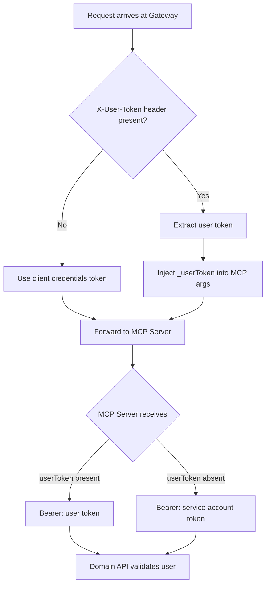

**For the POC**: The default token is `dummy-oauth-token-for-poc`. In production, replace with a real OAuth2 client credentials token or service account JWT.

### Auth Flow in Sequence Diagram

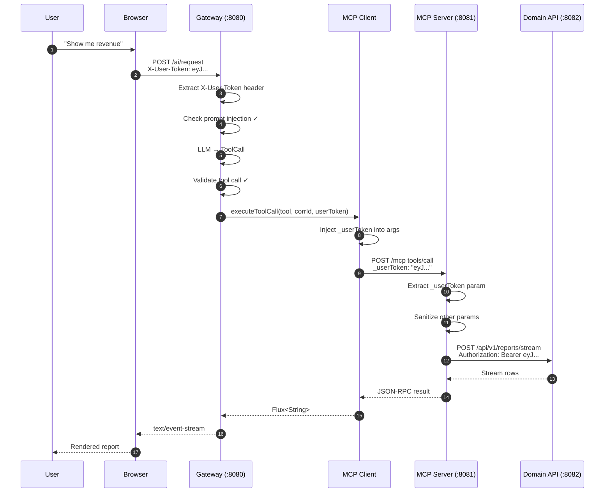

---

## Summary

| Question | Answer |
|----------|--------|
| **What is MCP Client?** | Component in Gateway that connects to MCP Server and invokes tools |
| **What does MCP Client do?** | Handles JSON-RPC over Streamable HTTP, manages session, calls tools |
| **What integrates with LLM?** | LlmProvider interface converts natural language → ToolCall |
| **What does MCP Server do?** | Exposes @McpTool annotated methods that can be called by clients |
| **How does data flow?** | Browser → Gateway → LLM → ToolCall → MCP Client → MCP Server → Domain API → back up |
| **Why raw MCP SDK?** | Avoids Jackson 3.x vs 2.x conflict with Spring Cloud Gateway |
| **Why Streamable HTTP?** | SSE is deprecated in MCP spec 2025-03-26. Streamable HTTP uses a single POST endpoint, is stateless-friendly, and works better with standard HTTP infrastructure |
