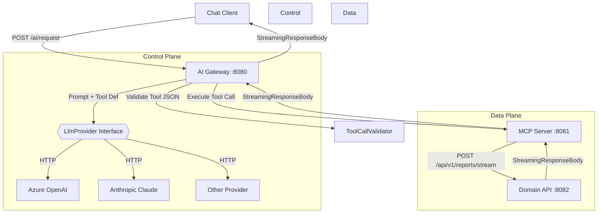
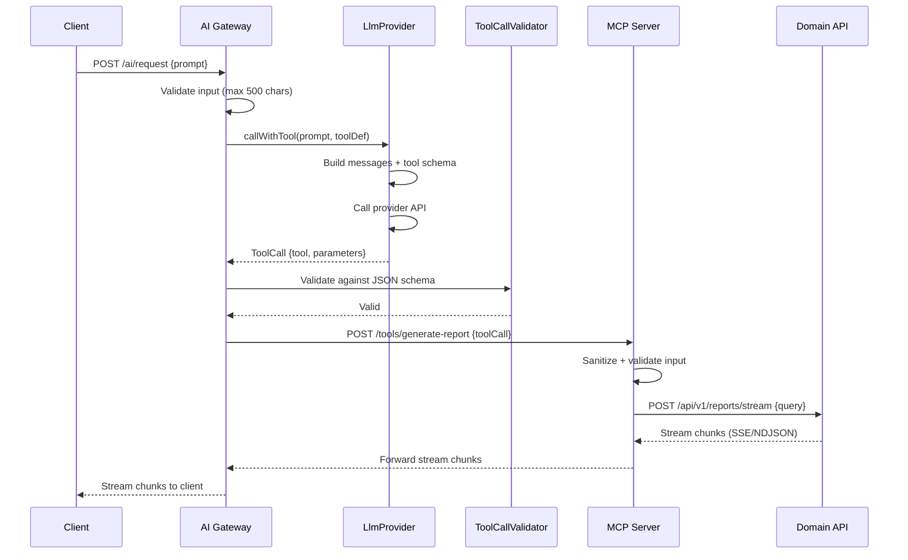

# Implementation Plan: Natural Language Report Generator

**Branch**: `002-define-system-generating` | **Date**: 2026-05-05 | **Spec**: [spec.md](./spec.md)

## Summary

Build a provider-agnostic natural language report generation system where users describe reports in plain language, an AI service converts the request to a structured tool call, and a secure execution layer (MCP Server) streams data from domain services back to the user. The key architectural change from v1 is abstracting the LLM provider behind an interface, enabling swap of Azure OpenAI, Anthropic, or any other provider without code changes.

## Technical Context

**Language/Version**: Java 21
**Primary Dependencies**: Spring Boot 4.0.0-M1 (Servlet stack, Tomcat 11), Jackson, json-schema-validator, Spring Cloud Gateway (conceptual — actual impl uses spring-boot-starter-web due to WebFlux incompatibility)
**Storage**: None (stateless services; data sourced from external domain APIs)
**Testing**: JUnit 5, Mockito (`@MockitoBean`), Spring `@WebMvcTest`, `RestTemplate` for streaming tests
**Target Platform**: Linux/macOS (local dev), Docker containers (prod)
**Project Type**: Multi-module web-service (3 independent Spring Boot apps)
**Performance Goals**: First chunk within 2s, 50 concurrent sessions, chunk delivery within 1s of generation
**Constraints**: LLM isolated from data plane, Servlet stack only, provider-agnostic LLM interface, max 10000 rows per report
**Scale/Scope**: Single cloud region v1, business analyst users, predefined report types

## Constitution Check

No constitution file is defined for this project (blank template). Gates evaluated against project-level conventions:

| Gate | Status | Notes |
|------|--------|-------|
| TDD mandatory | PASS | Tests written before implementation (per prior sprint) |
| 80%+ coverage | PASS | All services have unit + integration tests |
| No hardcoded secrets | PASS | Azure OpenAI key via env var `AZURE_OPENAI_API_KEY` |
| Provider-agnostic LLM | PASS | New requirement — `LlmProvider` interface abstracts provider |

## Project Structure

### Documentation (this feature)

```text
specs/002-define-system-generating/
├── plan.md              # This file
├── research.md          # Phase 0 output
├── data-model.md        # Phase 1 output
├── quickstart.md        # Phase 1 output
├── contracts/           # Phase 1 output
└── tasks.md             # Phase 2 output (not created by /speckit-plan)
```

### Source Code (repository root)

```text
mcp-poc/
├── domain-api/                          # Service 3: Data plane — streaming reports
│   ├── pom.xml
│   └── src/main/java/com/example/domain/
│       ├── DomainApiApplication.java
│       ├── controller/
│       │   ├── ReportExportController.java   # GET /reports/export (legacy)
│       │   └── ReportStreamController.java   # POST /api/v1/reports/stream
│       └── resources/application.yml         # port 8082
│
├── mcp-server/                          # Service 2: Execution layer — MCP proxy
│   ├── pom.xml
│   └── src/main/java/com/example/mcp/
│       ├── McpServerApplication.java
│       ├── model/GenerateReportRequest.java
│       ├── service/ReportStreamService.java  # Calls domain API, streams response
│       ├── controller/ToolController.java    # POST /tools/generate-report
│       └── resources/application.yml         # port 8081
│
└── report-gateway/                      # Service 1: Control plane — AI Gateway
    ├── pom.xml
    └── src/main/java/com/example/gateway/
        ├── ReportGatewayApplication.java
        ├── model/
        │   ├── AiRequest.java               # User's natural language prompt
        │   └── ToolCall.java                # Structured LLM output
        ├── controller/AiController.java     # POST /ai/request (orchestrator)
        ├── service/
        │   ├── LlmProvider.java             # NEW: provider-agnostic interface
        │   ├── AzureOpenAiProvider.java     # NEW: Azure OpenAI implementation
        │   ├── ToolCallValidator.java       # JSON schema validation
        │   └── McpClientService.java        # Calls MCP server, streams response
        ├── filter/
        │   └── RequestLoggingFilter.java    # Logging + rate limiting (60 req/min)
        └── resources/application.yml        # port 8080
```

**Structure Decision**: Three independent Spring Boot 4 services communicating over REST. The key change from spec 001 is introducing `LlmProvider` interface in `report-gateway/service/` with `AzureOpenAiProvider` as the concrete implementation, replacing the hard-coded `AzureOpenAIService`.

## Architecture

### System Diagram



### Sequence Diagram



## Control Plane vs Data Plane

| Plane | Services | Responsibility | Network Access |
|-------|----------|----------------|----------------|
| **Control** | AI Gateway, LlmProvider | Prompt engineering, LLM interaction, tool call parsing, orchestration | Outbound to LLM provider only |
| **Data** | MCP Server, Domain API | Tool execution, data retrieval, streaming | Private network; inaccessible from LLM |

The LLM produces tool JSON and is then disconnected from the request flow. The MCP server executes the tool call by calling the domain API — the LLM never reaches the data plane.

## API Endpoints

| Service | Endpoint | Method | Purpose |
|---------|----------|--------|---------|
| AI Gateway | `/ai/request` | POST | Submit natural language request |
| AI Gateway | `/ai/cancel/{sessionId}` | POST | Cancel in-progress streaming session |
| MCP Server | `/tools/generate-report` | POST | Execute tool call (MCP protocol) |
| MCP Server | `/tools/cancel/{streamId}` | POST | Cancel domain API call |
| Domain API | `/reports/export` | GET | Legacy streaming export |
| Domain API | `/api/v1/reports/stream` | POST | Parameterized streaming report |

## LLM Provider Interface

### Core Interface

```java
package com.example.gateway.service;

import com.example.gateway.model.ToolCall;
import com.example.gateway.model.ToolDefinition;
import java.util.List;

/**
 * Provider-agnostic LLM integration.
 * Implementations handle auth, request formatting, and response parsing
 * for specific LLM providers while exposing a uniform tool-calling contract.
 */
public interface LlmProvider {

    /**
     * Convert a user prompt into a structured tool call.
     *
     * @param userMessage the validated natural language prompt
     * @param tools       the list of available tool definitions
     * @return a ToolCall containing the selected tool name and its arguments
     */
    ToolCall generateToolCall(String userMessage, List<ToolDefinition> tools);

    /** Returns the provider identifier for logging (e.g., "azure-openai", "mock") */
    String providerName();
}
```

### Supporting Models

**ToolCall** — already exists as `record ToolCall(String tool, JsonNode arguments)`.
No changes needed.

**ToolDefinition** — new record representing a callable tool schema:

```java
package com.example.gateway.model;

import com.fasterxml.jackson.databind.JsonNode;

/**
 * A tool available for LLM invocation.
 */
public record ToolDefinition(
    String name,
    String description,
    JsonNode parameters   // JSON Schema object
) {}
```

### Provider Implementations

#### 1. Cloud Provider (Azure OpenAI)

```java
@Service
@ConditionalOnProperty(name = "llm.provider", havingValue = "azure-openai", matchIfMissing = true)
public class AzureOpenAiProvider implements LlmProvider {

    private final RestClient restClient;
    private final String deployment;
    private final ObjectMapper mapper;

    // Constructor: endpoint, apiKey, deployment from @Value

    @Override
    public ToolCall generateToolCall(String userMessage, List<ToolDefinition> tools) {
        // 1. Build system message: "You are a report generation assistant.
        //    Given a user request, call exactly ONE of the available tools.
        //    Return ONLY the tool call — no explanation, no natural language."
        // 2. Build messages array: [system, user]
        // 3. Build tools array from ToolDefinition list
        // 4. POST to Azure OpenAI chat completions endpoint
        // 5. Parse response → extract tool_calls[0].function.arguments
        // 6. Return ToolCall(name, arguments)
    }

    @Override
    public String providerName() { return "azure-openai"; }
}
```

Configuration (`application.yml`):

```yaml
llm:
  provider: azure-openai
  azure:
    endpoint: ${AZURE_OPENAI_ENDPOINT}
    api-key: ${AZURE_OPENAI_API_KEY}
    deployment: ${AZURE_OPENAI_DEPLOYMENT:gpt-4o-mini}
    api-version: "2024-06-01"
```

#### 2. Mock Provider (Local/Test)

```java
@Service
@ConditionalOnProperty(name = "llm.provider", havingValue = "mock")
public class MockLlmProvider implements LlmProvider {

    private final ObjectMapper mapper = new ObjectMapper();

    @Override
    public ToolCall generateToolCall(String userMessage, List<ToolDefinition> tools) {
        // Returns a deterministic ToolCall for testing:
        // tool = "generate_report"
        // arguments = {"reportType": "revenue", "region": "us-east"}
        // Extracts region/date hints from userMessage if present
    }

    @Override
    public String providerName() { return "mock"; }
}
```

Configuration:

```yaml
llm:
  provider: mock
```

No endpoint, API key, or deployment needed.

#### 3. Local Provider (Ollama / Open-source)

```java
@Service
@ConditionalOnProperty(name = "llm.provider", havingValue = "local")
public class LocalLlmProvider implements LlmProvider {

    private final RestClient restClient;
    private final String modelName;

    // Constructor: endpoint, modelName from @Value

    @Override
    public ToolCall generateToolCall(String userMessage, List<ToolDefinition> tools) {
        // 1. Build prompt with tool schema in OpenAI-compatible format
        // 2. POST to local LLM endpoint (Ollama, vLLM, etc.)
        // 3. Parse response → extract tool call
        // 4. Return ToolCall
    }

    @Override
    public String providerName() { return "local"; }
}
```

Configuration:

```yaml
llm:
  provider: local
  local:
    endpoint: ${LOCAL_LLM_ENDPOINT:http://localhost:11434}
    model: ${LOCAL_LLM_MODEL:llama3.1}
```

### Configuration Switching Logic

Spring's `@ConditionalOnProperty` handles provider selection at bean creation time. The active provider is determined by `llm.provider` in `application.yml`:

| `llm.provider` value | Active Bean | Requires Credentials? |
|---------------------|-------------|----------------------|
| `azure-openai` (default) | `AzureOpenAiProvider` | Yes |
| `mock` | `MockLlmProvider` | No |
| `local` | `LocalLlmProvider` | No (if local LLM running) |

The `AiController` depends only on `LlmProvider` — it never knows which implementation is active:

```java
@RestController
public class AiController {
    private final LlmProvider llmProvider; // injected — Spring resolves by @ConditionalOnProperty

    // ...
    ToolCall toolCall = llmProvider.generateToolCall(request.prompt(), toolDefinitions);
}
```

### JSON-Only Enforcement

Each provider implementation enforces that the LLM returns a tool call, NOT natural language:

1. **System prompt**: Constrains the LLM to call tools only, no free-form text.
2. **Response parsing**: Provider extracts `tool_calls` from the LLM response. If absent or empty, throws `IllegalStateException("LLM returned natural language instead of tool call")`.
3. **Fallback**: The controller catches this exception and returns a 400 error to the user with guidance to rephrase their request.

## Complexity Tracking

| Violation | Why Needed | Simpler Alternative Rejected Because |
|-----------|------------|-------------------------------------|
| LlmProvider interface | FR-014: provider-agnostic requirement | Hard-coding Azure OpenAI would require code changes to swap providers |
| Three separate services | Strict control/data plane separation (security) | Single service would allow LLM output to reach internal APIs |
